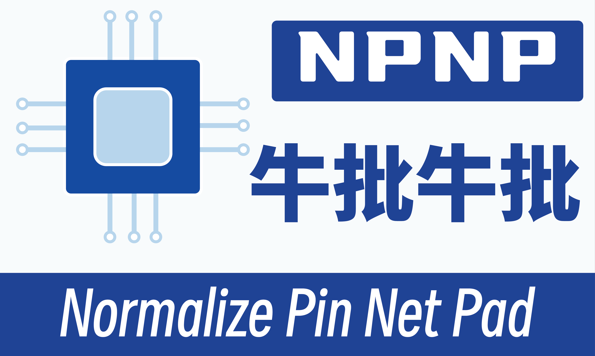

# npnp

<p align="center">
  
</p>

Languages: English | [简体中文](README.zh-CN.md)

Normalize Pin Net Pad (`npnp`) is a pure Rust LCEDA/EasyEDA downloader and Altium library exporter.

`npnp` searches LCEDA/LCSC components, downloads upstream EasyEDA source data and 3D models, and exports Altium-compatible schematic and PCB footprint libraries without C#, .NET, or external exporter DLLs.

## Features

- Search LCEDA/LCSC components by keyword, part name, or LCSC ID.
- Download 3D models as STEP or OBJ/MTL.
- Export raw EasyEDA symbol and footprint JSON for inspection.
- Export Altium schematic libraries (`.SchLib`).
- Export Altium PCB footprint libraries (`.PcbLib`).
- Embed STEP models into PCB libraries when upstream STEP data is available.
- Batch export many LCSC IDs from a text file.
- Export either one file per component or merged library pairs.
- Resume non-merged batch exports with checkpoint files.
- Retry transient LCEDA/EasyEDA request failures automatically.

## Requirements

- Rust toolchain for building from source.
- Network access to LCEDA/EasyEDA APIs when searching, downloading, or exporting.
- Windows is the primary tested environment.
- Altium Designer is recommended for final visual verification of generated `.SchLib` and `.PcbLib` files.

Install Rust from <https://rustup.rs/> if you do not already have it.

## Build From Source

Clone the repository:

```powershell
git clone https://github.com/<OWNER>/<REPO>.git npnp
cd npnp
```

Build a debug binary:

```powershell
cargo build
```

Build an optimized release binary:

```powershell
cargo build --release
```

Run the test suite:

```powershell
cargo test
```

Run formatting before publishing or sending a pull request:

```powershell
cargo fmt
```

Run a compile check without producing a release binary:

```powershell
cargo check
```

## Run From Source

When running through Cargo, put `--` before `npnp` arguments:

```powershell
cargo run --quiet --bin npnp -- --help
```

Show ready-to-run examples:

```powershell
cargo run --quiet --bin npnp -- --prompt
```

Show the package version:

```powershell
cargo run --quiet --bin npnp -- --version
```

Run any command from source:

```powershell
cargo run --quiet --bin npnp -- <COMMAND> [OPTIONS]
```

Example source-run search:

```powershell
cargo run --quiet --bin npnp -- search C2040 --limit 5
```

## Run As A Binary

After `cargo build --release`, the Windows binary is:

```powershell
.\target\release\npnp.exe
```

Show help from the built binary:

```powershell
.\target\release\npnp.exe --help
```

Show ready-to-run command examples:

```powershell
.\target\release\npnp.exe --prompt
```

Show the version:

```powershell
.\target\release\npnp.exe --version
```

Run a command with the built binary:

```powershell
.\target\release\npnp.exe <COMMAND> [OPTIONS]
```

If `npnp.exe` is on your `PATH`, use it directly:

```powershell
npnp --help
```

```powershell
npnp --prompt
```

```powershell
npnp search C2040 --limit 5
```

## Install Locally

Install the current checkout as a local Cargo binary:

```powershell
cargo install --path .
```

Verify the installed binary:

```powershell
npnp --version
```

Uninstall the local Cargo-installed binary:

```powershell
cargo uninstall npnp
```

After the crate is published to crates.io, users should be able to install it with:

```powershell
cargo install npnp
```

## Command Overview

Top-level help:

```powershell
npnp --help
```

Ready-to-run examples:

```powershell
npnp --prompt
```

Help for a specific command:

```powershell
npnp <COMMAND> --help
```

Available commands:

- `search`
- `download-step`
- `download-obj`
- `export-source`
- `export-schlib`
- `export-pcblib`
- `bundle`
- `batch`

## Command: `search`

Search components by keyword, LCSC ID, manufacturer part, or broad text.

Usage:

```powershell
npnp search <KEYWORD> [--limit <LIMIT>]
```

Examples:

```powershell
npnp search C2040 --limit 5
```

```powershell
npnp search RP2040 --limit 10
```

```powershell
npnp search TYPE-C --limit 20
```

Options:

- `--limit <LIMIT>` controls how many search rows are printed. Default: `20`.

Output includes the search result index, display name, LCSC ID when available, manufacturer, and whether a 3D model is listed.

## Search Result Indexes

Most export/download commands accept `--index <INDEX>`. The default is `--index 1`.

Use this workflow for broad searches:

```powershell
npnp search TYPE-C --limit 20
```

Then export the exact row you want:

```powershell
npnp export-schlib TYPE-C --index 3 --output schlib --force
```

When `<KEYWORD>` is an exact LCSC ID like `C2040` and `--index` is left at `1`, `npnp` prefers the search result whose LCSC ID exactly matches the keyword. Explicit non-default indexes still select the requested search row.

## Command: `download-step`

Download a STEP file for the selected component result.

Usage:

```powershell
npnp download-step <KEYWORD> [--index <INDEX>] [--output <DIR>] [--force]
```

Examples:

```powershell
npnp download-step C2040 --output step --force
```

```powershell
npnp download-step RP2040 --index 1 --output models\step --force
```

Options:

- `--index <INDEX>` selects the search result row. Default: `1`.
- `--output <DIR>` sets the output directory. Default: `step`.
- `--force` overwrites an existing output file.

Typical output layout:

```text
step/
  <footprint-or-component-name>.step
```

## Command: `download-obj`

Download OBJ and MTL files for the selected component result.

Usage:

```powershell
npnp download-obj <KEYWORD> [--index <INDEX>] [--output <DIR>] [--force]
```

Examples:

```powershell
npnp download-obj C2040 --output obj --force
```

```powershell
npnp download-obj RP2040 --index 1 --output models\obj --force
```

Options:

- `--index <INDEX>` selects the search result row. Default: `1`.
- `--output <DIR>` sets the output directory. Default: `obj`.
- `--force` overwrites existing OBJ/MTL files.

Typical output layout:

```text
obj/
  <component-name>.obj
  <component-name>.mtl
```

## Command: `export-source`

Export raw EasyEDA symbol and footprint source JSON files only.

Use this command when you want to inspect upstream payloads before generating Altium libraries.

Usage:

```powershell
npnp export-source <KEYWORD> [--index <INDEX>] [--output <DIR>] [--force]
```

Examples:

```powershell
npnp export-source C2040 --output easyeda_src --force
```

```powershell
npnp export-source RP2040 --index 1 --output debug\easyeda_src --force
```

Options:

- `--index <INDEX>` selects the search result row. Default: `1`.
- `--output <DIR>` sets the output directory. Default: `easyeda_src`.
- `--force` overwrites existing source JSON files.

Typical output layout:

```text
easyeda_src/
  <component-name>_symbol_easyeda.json
  <component-name>_footprint_easyeda.json
```

## Command: `export-schlib`

Export a pure Rust Altium schematic library (`.SchLib`).

Usage:

```powershell
npnp export-schlib <KEYWORD> [--index <INDEX>] [--output <DIR>] [--force]
```

Examples:

```powershell
npnp export-schlib C2040 --output schlib --force
```

```powershell
npnp export-schlib RP2040 --index 1 --output out\schlib --force
```

Options:

- `--index <INDEX>` selects the search result row. Default: `1`.
- `--output <DIR>` sets the output directory. Default: `schlib`.
- `--force` overwrites an existing `.SchLib` file.

Current schematic export includes:

- Symbol body and graphics.
- Pins.
- Multipart symbols when present in source data.
- Metadata records such as `Designator`, `Comment`, `Description`, and parameters.
- PCB footprint implementation links when footprint data is available.

Typical output layout:

```text
schlib/
  <component-name>.SchLib
```

## Command: `export-pcblib`

Export a pure Rust Altium PCB footprint library (`.PcbLib`).

Usage:

```powershell
npnp export-pcblib <KEYWORD> [--index <INDEX>] [--output <DIR>] [--force]
```

Examples:

```powershell
npnp export-pcblib C2040 --output pcblib --force
```

```powershell
npnp export-pcblib RP2040 --index 1 --output out\pcblib --force
```

Options:

- `--index <INDEX>` selects the search result row. Default: `1`.
- `--output <DIR>` sets the output directory. Default: `pcblib`.
- `--force` overwrites an existing `.PcbLib` file.

Current PCB export includes:

- Pads.
- Tracks, arcs, regions, and footprint primitives mapped from EasyEDA data.
- 3D STEP model embedding when a usable upstream STEP model exists.
- Empty 3D body output when no usable STEP model is available.

Typical output layout:

```text
pcblib/
  <component-name>.PcbLib
```

## Command: `bundle`

Export a source bundle for one selected component.

The bundle command writes EasyEDA source JSON files, a STEP file when available, and a manifest JSON file that records the selected component and generated artifacts.

Usage:

```powershell
npnp bundle <KEYWORD> [--index <INDEX>] [--output <DIR>] [--force]
```

Examples:

```powershell
npnp bundle C2040 --output bundle --force
```

```powershell
npnp bundle RP2040 --index 1 --output out\bundle --force
```

Options:

- `--index <INDEX>` selects the search result row. Default: `1`.
- `--output <DIR>` sets the output directory. Default: `bundle`.
- `--force` overwrites existing bundle files.

Typical output layout:

```text
bundle/
  <component-name>_symbol_easyeda.json
  <component-name>_footprint_easyeda.json
  <footprint-or-component-name>.step
  <component-name>_bundle.json
```

The STEP file appears only when the selected component has an upstream 3D model.

## Command: `batch`

Batch export Altium libraries from a text file containing LCSC IDs.

Usage:

```powershell
npnp batch --input <FILE> [--output <DIR>] [--schlib] [--pcblib] [--full] [--merge] [--library-name <NAME>] [--parallel <N>] [--continue-on-error] [--force]
```

Short input flag:

```powershell
npnp batch -i ids.txt --output batch_out --full --force
```

The input parser extracts IDs in the form `C<number>` from arbitrary text. It accepts lowercase IDs like `c2040`, deduplicates repeated IDs, and preserves first-seen order.

Example `ids.txt`:

```text
C2040
C12074
C569043
```

Export both schematic and PCB libraries, one file per component:

```powershell
npnp batch --input ids.txt --output batch_out --full --parallel 4 --continue-on-error --force
```

Export only schematic libraries:

```powershell
npnp batch --input ids.txt --output batch_schlib --schlib --parallel 4 --continue-on-error --force
```

Export only PCB libraries:

```powershell
npnp batch --input ids.txt --output batch_pcblib --pcblib --parallel 4 --continue-on-error --force
```

Export both targets using explicit flags instead of `--full`:

```powershell
npnp batch --input ids.txt --output batch_out --schlib --pcblib --parallel 4 --continue-on-error --force
```

Write one merged `.SchLib` and one merged `.PcbLib`:

```powershell
npnp batch --input ids.txt --output merged_out --merge --library-name MyLib --full --continue-on-error --force
```

Write only a merged schematic library:

```powershell
npnp batch --input ids.txt --output merged_schlib --merge --library-name MySchLib --schlib --continue-on-error --force
```

Write only a merged PCB library:

```powershell
npnp batch --input ids.txt --output merged_pcblib --merge --library-name MyPcbLib --pcblib --continue-on-error --force
```

Batch options:

- `--input <FILE>` or `-i <FILE>` is required.
- `--output <DIR>` sets the output directory. Default: `batch`.
- `--schlib` exports schematic libraries.
- `--pcblib` exports PCB libraries.
- `--full` exports both schematic and PCB libraries.
- `--merge` writes one merged library per selected target instead of one file per component.
- `--library-name <NAME>` sets the merged output filename prefix.
- `--parallel <N>` sets concurrent jobs for non-merged batch export. Default: `4`.
- `--continue-on-error` keeps processing remaining IDs if one ID fails.
- `--force` ignores checkpoint skips and overwrites existing outputs.

Non-merged batch output layout:

```text
batch_out/
  .checkpoint
  schlib/
    <component-a>.SchLib
    <component-b>.SchLib
  pcblib/
    <component-a>.PcbLib
    <component-b>.PcbLib
```

Merged batch output layout:

```text
merged_out/
  MyLib.SchLib
  MyLib.PcbLib
```

Checkpoint behavior:

- Non-merged batch exports create `.checkpoint` in the output directory.
- Completed IDs are written to `.checkpoint`.
- Later runs skip completed IDs unless `--force` is used.
- Merged batch exports rebuild the merged output and do not use the non-merged checkpoint layout.

## Recommended Workflows

Exact LCSC ID workflow:

```powershell
npnp search C2040 --limit 5
npnp export-schlib C2040 --output out\schlib --force
npnp export-pcblib C2040 --output out\pcblib --force
```

Broad keyword workflow:

```powershell
npnp search TYPE-C --limit 20
npnp export-schlib TYPE-C --index 3 --output out\schlib --force
npnp export-pcblib TYPE-C --index 3 --output out\pcblib --force
```

Source inspection workflow:

```powershell
npnp export-source C2040 --output inspect\easyeda --force
npnp bundle C2040 --output inspect\bundle --force
```

Batch verification workflow:

```powershell
npnp batch --input ids.txt --output generated\check --full --force --continue-on-error
```

Merged library verification workflow:

```powershell
npnp batch --input ids.txt --output generated\merged_check --merge --library-name MyLib --full --force --continue-on-error
```

## License

`npnp` is released under the custom non-commercial source license in `LICENSE.md`.

- Personal, educational, research, evaluation, and other non-commercial use is allowed.
- Commercial use, paid redistribution, paid service use, or commercial product integration requires prior written permission.
- If you publish, distribute, or share modified source code, keep visible attribution to the original `npnp` project and either describe your changes or submit them back as a pull request or patch proposal.
- This is a source-available non-commercial license, not an OSI open-source license.
## Publishing Preparation

Before pushing to GitHub or publishing to crates.io, run the checks below. This crate uses a custom non-commercial license through `license-file = "LICENSE.md"`, so verify that `LICENSE.md` is included in the package:

```powershell
cargo fmt
```

```powershell
cargo test
```

```powershell
cargo build --release
```

Preview what Cargo will package:

```powershell
cargo package --list
```

Run a local packaging check:

```powershell
cargo package --allow-dirty
```

Run a crates.io publish dry run:

```powershell
cargo publish --dry-run
```

Publish after crate metadata, versioning, repository URL, license, and README are final:

```powershell
cargo publish
```

After publishing, users can install with:

```powershell
cargo install npnp
```

## Notes On Generated Files

- Output filenames are sanitized for Windows-unsafe characters.
- Existing files are preserved unless `--force` is passed.
- STEP embedding depends on upstream LCEDA/EasyEDA model availability and payload quality.
- If a footprint opens without a 3D body, the upstream STEP model may be missing, invalid, or not linked from the selected component.
- The generated libraries should be opened in Altium Designer for final visual verification before production use.

## Troubleshooting

No valid IDs found in batch input:

```powershell
npnp batch --input ids.txt --output batch_out --full
```

Check that `ids.txt` contains values like:

```text
C2040
C12074
C569043
```

Wrong component exported from a broad keyword:

```powershell
npnp search <KEYWORD> --limit 20
```

Then pass the desired result row:

```powershell
npnp export-schlib <KEYWORD> --index <ROW> --output schlib --force
```

Existing output was not overwritten:

```powershell
npnp export-pcblib C2040 --output pcblib --force
```

Resume or rerun a non-merged batch export:

```powershell
npnp batch --input ids.txt --output batch_out --full --continue-on-error
```

Force a full non-merged batch rebuild:

```powershell
npnp batch --input ids.txt --output batch_out --full --force --continue-on-error
```

Network/API issues:

- Confirm that the machine can reach LCEDA/EasyEDA APIs.
- Retry later if LCEDA/EasyEDA is temporarily unavailable.
- `npnp` automatically retries transient request failures such as timeouts, connection failures, rate limiting, and server-side `5xx` responses.

## Development Commands

Run all tests:

```powershell
cargo test
```

Run only library unit tests:

```powershell
cargo test --lib
```

Run only the export regression integration test:

```powershell
cargo test --test export_regression
```

Run with help output during development:

```powershell
cargo run --quiet --bin npnp -- --help
```

Inspect a generated `.PcbLib` compound-file layout with the helper binary:

```powershell
cargo run --quiet --bin inspect_pcblib -- generated\merged_check\MyLib.PcbLib
```

Dump a stream from a generated compound file:

```powershell
cargo run --quiet --bin dump_stream -- generated\merged_check\MyLib.PcbLib /FileHeader 0
```

Dump bytes from a stream in a generated compound file:

```powershell
cargo run --quiet --bin dump_hex -- generated\merged_check\MyLib.PcbLib /FileHeader 0 64
```