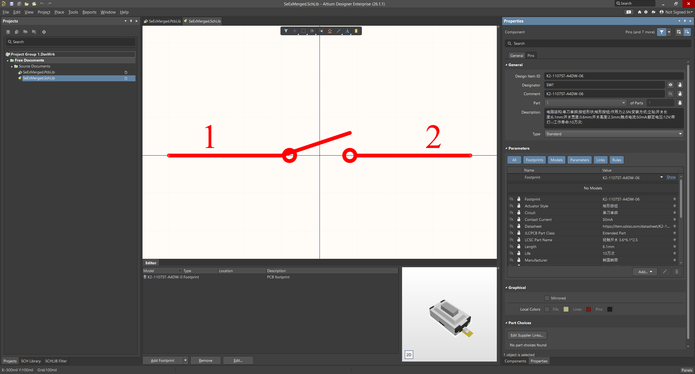
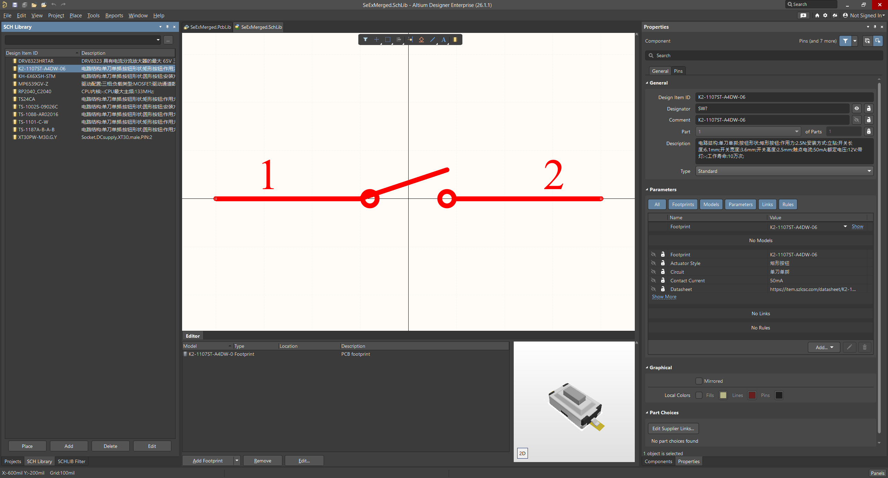
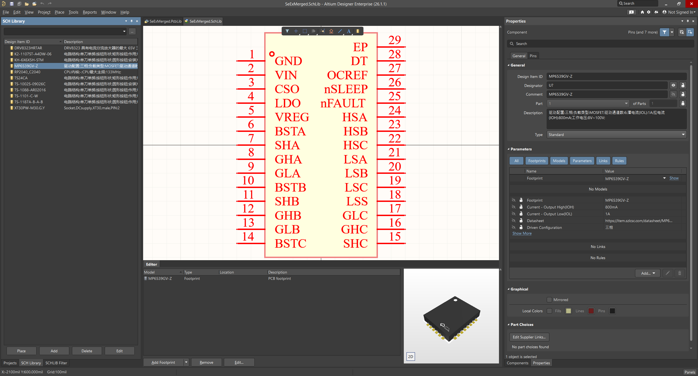
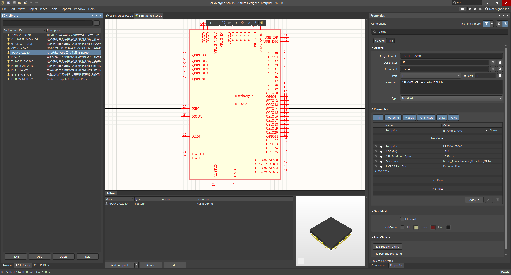
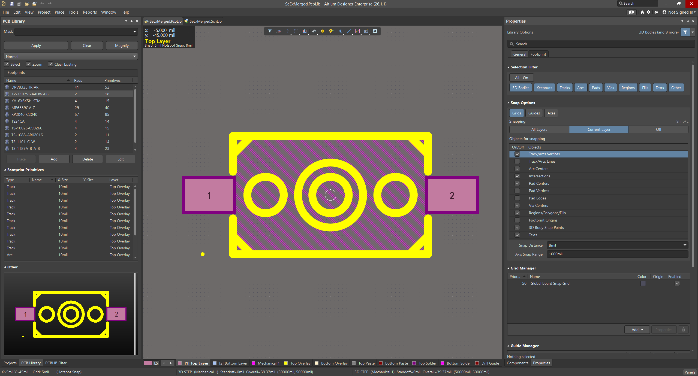
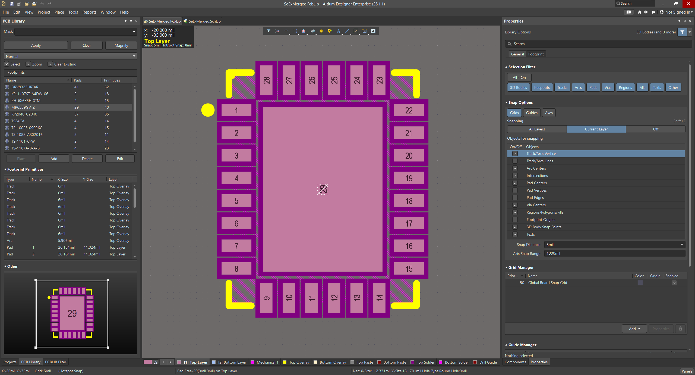
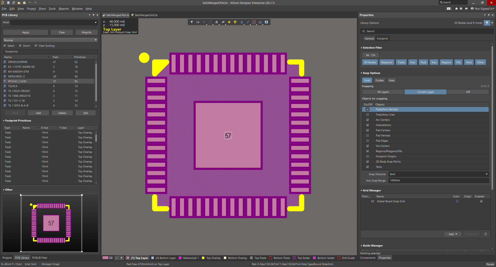

# npnp

<p align="center">
  
</p>

<p align="center">
  <a href="Cargo.toml"></a>
  <a href="LICENSE.md"></a>
  <a href=".github/workflows/windows-release.yml"></a>
  <a href="https://www.rust-lang.org/"></a>
</p>

语言： [English](README.md) | 简体中文

Normalize Pin Net Pad（`npnp`）是一个纯 Rust 编写的 LCEDA/EasyEDA 下载器和 Altium 库导出工具。

`npnp` 可以搜索 LCEDA/LCSC 元器件，下载上游 EasyEDA 源数据和 3D 模型，并导出 Altium 兼容的原理图库和 PCB 封装库。

## 功能

- 按关键字、器件名、制造商型号或 LCSC ID 搜索 LCEDA/LCSC 元器件。
- 下载 3D 模型为 STEP 或 OBJ/MTL。
- 导出原始 EasyEDA 符号 JSON 和封装 JSON，方便检查与调试。
- 导出 Altium 原理图库（`.SchLib`）。
- 导出 Altium PCB 封装库（`.PcbLib`）。
- 当上游 STEP 数据可用时，将 STEP 模型嵌入到 PCB 封装库。
- 从文本文件批量导出多个 LCSC ID。
- 支持每个元器件单独导出，也支持合并为一组库文件。
- 支持向已有的 `npnp` 合并库中追加缺失器件，并按 LCSC ID 跳过重复项。
- `batch` 支持实时进度显示，包含成功、跳过、失败、活动任务数、耗时和最近处理的器件。
- 非合并批量导出支持 checkpoint，便于断点续跑。
- 自动重试 LCEDA/EasyEDA 的临时网络错误，例如超时、限流和服务端 `5xx`。

## 环境要求

- 如果从源码构建，需要安装 Rust toolchain。
- 搜索、下载、导出时需要访问 LCEDA/EasyEDA API。
- Altium Designer 或兼容工具用于最终打开和检查 `.SchLib` / `.PcbLib`。

## 从源码构建

克隆仓库：

```powershell
git clone https://github.com/linkyourbin/npnp.git npnp
cd npnp
```

开发构建：

```powershell
cargo build
```

Release 构建：

```powershell
cargo build --release
```

运行测试：

```powershell
cargo test
```

格式化代码：

```powershell
cargo fmt
```

Release 二进制输出位置：

```powershell
.\target\release\npnp.exe
```

如果你不想安装到系统路径，可以直接运行这个二进制。

## 从源码运行

通过 Cargo 运行时，`--` 后面的参数才会传给 `npnp`：

```powershell
cargo run --quiet --bin npnp -- --help
```

显示可直接复制执行的示例命令：

```powershell
cargo run --quiet --bin npnp -- --prompt
```

显示版本：

```powershell
cargo run --quiet --bin npnp -- --version
```

运行任意子命令：

```powershell
cargo run --quiet --bin npnp -- <COMMAND> [OPTIONS]
```

示例：

```powershell
cargo run --quiet --bin npnp -- search C2040 --limit 5
```

## 以二进制运行

构建 release 后，Windows 二进制路径为：

```powershell
.\target\release\npnp.exe
```

查看帮助：

```powershell
.\target\release\npnp.exe --help
```

显示可直接复制执行的示例命令：

```powershell
.\target\release\npnp.exe --prompt
```

显示版本：

```powershell
.\target\release\npnp.exe --version
```

运行任意子命令：

```powershell
.\target\release\npnp.exe <COMMAND> [OPTIONS]
```

如果 `npnp.exe` 已经在 `PATH` 中，可以直接运行：

```powershell
npnp --help
```

```powershell
npnp --prompt
```

```powershell
npnp search C2040 --limit 5
```

## 本地安装

从当前源码目录安装：

```powershell
cargo install --path .
```

安装后检查版本：

```powershell
npnp --version
```

卸载本地安装版本：

```powershell
cargo uninstall npnp
```

该工具已发布到crates.io，电脑上存在 Rust 开发环境的用户可以这样安装：

```powershell
cargo install npnp
```

## 命令总览

查看主帮助：

```powershell
npnp --help
```

显示 ready-to-run 示例命令：

```powershell
npnp --prompt
```

查看子命令帮助：

```powershell
npnp <COMMAND> --help
```

当前主要子命令：

- `search`
- `download-step`
- `download-obj`
- `export-source`
- `export-schlib`
- `export-pcblib`
- `bundle`
- `batch`

## 命令：`search`

按关键字、LCSC ID、制造商型号或普通文本搜索元器件。

语法：

```powershell
npnp search <KEYWORD> [--limit <LIMIT>]
```

示例：

```powershell
npnp search C2040 --limit 5
```

```powershell
npnp search RP2040 --limit 10
```

```powershell
npnp search TYPE-C --limit 20
```

参数：

- `<KEYWORD>` 是搜索关键字，例如 `C2040`、`RP2040`、`TYPE-C`。
- `--limit <LIMIT>` 控制打印的搜索结果数量，默认值是 `20`。
- `--prompt` 显示可直接复制执行的示例命令。

输出通常包含搜索结果序号、显示名称、LCSC ID、制造商信息，以及是否有 3D 模型。

## 搜索结果序号

很多导出命令都有 `--index` 参数。这个序号对应 `search` 输出中的结果行，默认是 `1`。

宽泛关键字建议先搜索，再按序号导出：

```powershell
npnp search TYPE-C --limit 20
```

如果你想导出第 3 条结果：

```powershell
npnp export-schlib TYPE-C --index 3 --output schlib --force
```

当 `<KEYWORD>` 是精确 LCSC ID，例如 `C2040`，并且 `--index` 保持默认值 `1` 时，`npnp` 会优先选择 LCSC ID 精确匹配的结果。显式传入非默认 `--index` 时，会按指定结果行选择。

## 命令：`download-step`

搜索一个元器件，并按搜索结果序号下载 STEP 3D 模型。

语法：

```powershell
npnp download-step <KEYWORD> [--index <INDEX>] [--output <DIR>] [--force]
```

示例：

```powershell
npnp download-step C2040 --output step --force
```

```powershell
npnp download-step RP2040 --index 1 --output models\step --force
```

参数：

- `<KEYWORD>` 是搜索关键字或 LCSC ID。
- `--index <INDEX>` 选择搜索结果行，默认值是 `1`。
- `--output <DIR>` 设置输出目录，默认值是 `step`。
- `--force` 允许覆盖已有文件。
- `--prompt` 显示可直接复制执行的示例命令。

输出通常是一个 `.step` 或 `.stp` 文件，具体取决于上游模型数据。

## 命令：`download-obj`

搜索一个元器件，并按搜索结果序号下载 OBJ/MTL 3D 模型。

语法：

```powershell
npnp download-obj <KEYWORD> [--index <INDEX>] [--output <DIR>] [--force]
```

示例：

```powershell
npnp download-obj C2040 --output obj --force
```

```powershell
npnp download-obj RP2040 --index 1 --output models\obj --force
```

参数：

- `<KEYWORD>` 是搜索关键字或 LCSC ID。
- `--index <INDEX>` 选择搜索结果行，默认值是 `1`。
- `--output <DIR>` 设置输出目录，默认值是 `obj`。
- `--force` 允许覆盖已有文件。
- `--prompt` 显示可直接复制执行的示例命令。

输出通常包含 `.obj`、`.mtl`，以及上游模型中引用的材质文件。

## 命令：`export-source`

导出 EasyEDA 原始符号和封装 JSON 源数据，不生成 Altium 库文件。

这个命令适合调试、检查上游数据，或在导出结果异常时保存原始输入。

语法：

```powershell
npnp export-source <KEYWORD> [--index <INDEX>] [--output <DIR>] [--force]
```

示例：

```powershell
npnp export-source C2040 --output easyeda_src --force
```

```powershell
npnp export-source RP2040 --index 1 --output debug\easyeda_src --force
```

参数：

- `<KEYWORD>` 是搜索关键字或 LCSC ID。
- `--index <INDEX>` 选择搜索结果行，默认值是 `1`。
- `--output <DIR>` 设置输出目录，默认值是 `easyeda_src`。
- `--force` 允许覆盖已有文件。
- `--prompt` 显示可直接复制执行的示例命令。

输出通常包含：

- EasyEDA symbol JSON。
- EasyEDA footprint JSON。
- 与所选元器件相关的源数据文件。

## 命令：`export-schlib`

导出纯 Rust 生成的 Altium 原理图库（`.SchLib`）。

语法：

```powershell
npnp export-schlib <KEYWORD> [--index <INDEX>] [--output <DIR>] [--force]
```

示例：

```powershell
npnp export-schlib C2040 --output schlib --force
```

```powershell
npnp export-schlib RP2040 --index 1 --output out\schlib --force
```

参数：

- `<KEYWORD>` 是搜索关键字或 LCSC ID。
- `--index <INDEX>` 选择搜索结果行，默认值是 `1`。
- `--output <DIR>` 设置输出目录，默认值是 `schlib`。
- `--force` 允许覆盖已有文件。
- `--prompt` 显示可直接复制执行的示例命令。

输出是 `.SchLib` 文件。

建议导出后在 Altium Designer 中打开并检查：

- 引脚编号。
- 引脚名称。
- 元器件外框。
- Comment / Designator 等字段。

## 命令：`export-pcblib`

导出纯 Rust 生成的 Altium PCB 封装库（`.PcbLib`）。

语法：

```powershell
npnp export-pcblib <KEYWORD> [--index <INDEX>] [--output <DIR>] [--force]
```

示例：

```powershell
npnp export-pcblib C2040 --output pcblib --force
```

```powershell
npnp export-pcblib RP2040 --index 1 --output out\pcblib --force
```

参数：

- `<KEYWORD>` 是搜索关键字或 LCSC ID。
- `--index <INDEX>` 选择搜索结果行，默认值是 `1`。
- `--output <DIR>` 设置输出目录，默认值是 `pcblib`。
- `--force` 允许覆盖已有文件。
- `--prompt` 显示可直接复制执行的示例命令。

输出是 `.PcbLib` 文件。

如果上游 LCEDA/EasyEDA 提供可用 STEP 模型，`npnp` 会尝试嵌入 3D body。建议导出后在 Altium Designer 中检查：

- Pads。
- Tracks / arcs / fills 等图元。
- Courtyard / silkscreen / assembly 等层。
- 3D body 是否存在且位置合理。

## 命令：`bundle`

为一个选中的元器件导出源数据 bundle。

`bundle` 会写出 EasyEDA source JSON、可用时的 STEP 文件，以及记录所选元器件和产物路径的 manifest JSON。

语法：

```powershell
npnp bundle <KEYWORD> [--index <INDEX>] [--output <DIR>] [--force]
```

示例：

```powershell
npnp bundle C2040 --output bundle --force
```

```powershell
npnp bundle RP2040 --index 1 --output out\bundle --force
```

参数：

- `<KEYWORD>` 是搜索关键字或 LCSC ID。
- `--index <INDEX>` 选择搜索结果行，默认值是 `1`。
- `--output <DIR>` 设置输出目录，默认值是 `bundle`。
- `--force` 允许覆盖已有 bundle 文件。
- `--prompt` 显示可直接复制执行的示例命令。

典型输出结构：

```text
bundle/
  <component-name>_symbol.json
  <component-name>_footprint.json
  <component-name>.step
  <component-name>_bundle.json
```

## 命令：`batch`

从包含 LCSC ID 的文本文件批量导出 Altium 库。

语法：

```powershell
npnp batch --input <FILE> [--output <DIR>] [--schlib] [--pcblib] [--full] [--merge] [--append] [--library-name <NAME>] [--parallel <N>] [--continue-on-error] [--force]
```

输入文件示例：

```text
C2040
C12074
C569043
```

导出每个元器件的原理图库和 PCB 库：

```powershell
npnp batch -i ids.txt --output batch_out --full --force
```

带并发和错误继续：

```powershell
npnp batch --input ids.txt --output batch_out --full --parallel 4 --continue-on-error --force
```

只导出原理图库：

```powershell
npnp batch --input ids.txt --output batch_schlib --schlib --parallel 4 --continue-on-error --force
```

只导出 PCB 封装库：

```powershell
npnp batch --input ids.txt --output batch_pcblib --pcblib --parallel 4 --continue-on-error --force
```

同时导出原理图库和 PCB 封装库：

```powershell
npnp batch --input ids.txt --output batch_out --schlib --pcblib --parallel 4 --continue-on-error --force
```

合并导出为一组库文件：

```powershell
npnp batch --input ids.txt --output merged_out --merge --library-name MyLib --full --continue-on-error --force
```

只合并原理图库：

```powershell
npnp batch --input ids.txt --output merged_schlib --merge --library-name MySchLib --schlib --continue-on-error --force
```

只合并 PCB 封装库：

```powershell
npnp batch --input ids.txt --output merged_pcblib --merge --library-name MyPcbLib --pcblib --continue-on-error --force
```

向已有的 `npnp` 合并库中追加缺失器件：

```powershell
npnp batch --input new_ids.txt --output merged_out --merge --append --library-name MyLib --full --continue-on-error
```

Batch 参数：

- `-i, --input <FILE>` 指定输入文本文件。
- `--output <DIR>` 设置输出目录，默认值是 `batch`。
- `--schlib` 导出原理图库。
- `--pcblib` 导出 PCB 封装库。
- `--full` 等价于同时开启 `--schlib` 和 `--pcblib`。
- `--merge` 将多个元器件合并到同一组库文件中。
- `--append` 只向已有的 `npnp` 合并库中追加缺失器件，并按 LCSC ID 跳过重复项。
- `--library-name <NAME>` 设置合并库文件名。
- `--parallel <N>` 设置非合并批量导出的并发任务数，默认值是 `4`。
- `--continue-on-error` 某个元器件失败时继续处理后续 ID。
- `--force` 允许覆盖已有输出。
- `--prompt` 显示可直接复制执行的示例命令。

非合并输出结构：

```text
batch_out/
  .checkpoint
  C2040/
    <component>.SchLib
    <component>.PcbLib
  C12074/
    <component>.SchLib
    <component>.PcbLib
```

合并输出结构：

```text
merged_out/
  MyLib.SchLib
  MyLib.PcbLib
```

Checkpoint 说明：

- 非合并批量导出会在输出目录生成 `.checkpoint`。
- 如果再次运行同一个非合并批量导出，已完成的 ID 可以被跳过。
- 传入 `--force` 会覆盖已有输出。
- 合并批量导出会重新生成合并库文件，不使用非合并 checkpoint 布局。
- 合并 `--append` 会读取已有的 `npnp` 合并库，跳过重复 LCSC ID，再写回更新后的合并库。

## 推荐工作流

单个元器件导出：

```powershell
npnp search C2040 --limit 5
npnp export-schlib C2040 --output out\schlib --force
npnp export-pcblib C2040 --output out\pcblib --force
```

宽泛关键字搜索后按序号导出：

```powershell
npnp search TYPE-C --limit 20
npnp export-schlib TYPE-C --index 3 --output out\schlib --force
npnp export-pcblib TYPE-C --index 3 --output out\pcblib --force
```

保存源数据用于检查：

```powershell
npnp export-source C2040 --output inspect\easyeda --force
npnp bundle C2040 --output inspect\bundle --force
```

批量验证工作流：

```powershell
npnp batch --input ids.txt --output generated\check --full --force --continue-on-error
```

合并库验证工作流：

```powershell
npnp batch --input ids.txt --output generated\merged_check --merge --library-name MyLib --full --force --continue-on-error
```

合并库追加工作流：

```powershell
npnp batch --input more_ids.txt --output generated\merged_check --merge --append --library-name MyLib --full --continue-on-error
```

## 合并输出截图

`imgs/` 目录保存了由 `npnp` 合并导出结果生成的截图。

这些示例来自类似下面的合并导出流程：

```powershell
npnp batch --input ids.txt --output generated\merged_check --merge --library-name MyLib --full --force --continue-on-error
```

总览：



原理图库截图：

<p align="center">
  
  
  
</p>

PCB 封装库截图：

<p align="center">
  
  
  
</p>

## 许可证

`npnp` 现在采用与当前项目诉求最接近的标准许可证：`LICENSE.md` 中的 `PolyForm-Noncommercial-1.0.0`。

- 允许非商业用途、研究、评估和个人实验使用。
- 商业使用、付费再分发、付费服务使用，或在商业工作流中使用，需要额外获得作者许可。
- 如果再分发项目，请保留许可证文本和必需声明。
- PolyForm 许可证本身不会强制要求提交 pull request。当前项目仍然希望任何公开发布修改版的人注明原始 `npnp` 项目，并尽量把修改以 pull request 的形式反馈回来。
- 这是 source-available 的非商业许可证，不是 OSI open-source 许可证。

## 生成文件说明

- 输出文件名会自动清理 Windows 不安全字符。
- 除非传入 `--force`，已有文件会被保留。
- STEP 嵌入依赖上游 LCEDA/EasyEDA 模型是否存在以及数据质量。
- 如果 PCB 封装能打开但没有 3D body，可能是上游 STEP 缺失、无效，或没有关联到所选元器件。
- 生产使用前，应在 Altium Designer 中进行最终可视检查。

## 故障排查

Batch 输入没有有效 ID：

```powershell
npnp batch --input ids.txt --output batch_out --full
```

请确认 `ids.txt` 包含类似下面的值：

```text
C2040
C12074
C569043
```

宽泛关键字导出了错误元器件：

```powershell
npnp search <KEYWORD> --limit 20
```

然后传入想要的结果行：

```powershell
npnp export-schlib <KEYWORD> --index <ROW> --output schlib --force
```

PCB 库缺少 3D body：

```powershell
npnp export-pcblib C2040 --output pcblib --force
```

如果上游没有 STEP 模型，`npnp` 会导出没有 3D body 的 PCB 封装。

恢复或重跑非合并批量导出：

```powershell
npnp batch --input ids.txt --output batch_out --full --continue-on-error
```

强制完整重建非合并批量导出：

```powershell
npnp batch --input ids.txt --output batch_out --full --force --continue-on-error
```

批量导出终端进度：

- `batch` 会显示实时进度行，包含 `ok`、`skip`、`fail`、`active`、耗时和最近处理的器件。
- `SKIP ...` 和 `FAILED ...` 会以单独事件行输出。
- 合并和追加模式会额外提示“加载已有库”和“写回合并输出”等阶段信息。

网络不稳定：

